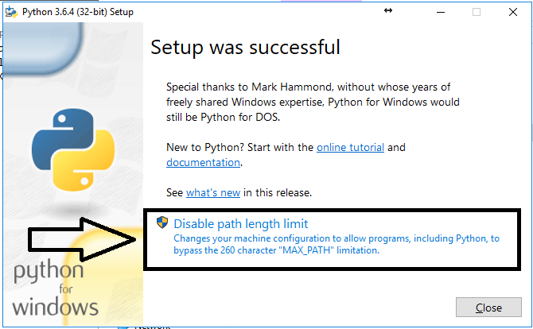
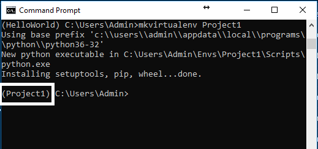
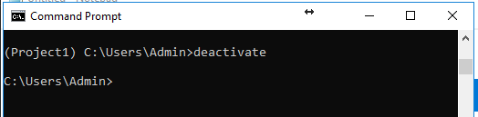
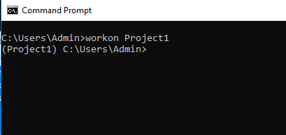

# How to install Python and Virtualenv on Windows 10

#### Intall Python from https://www.python.org/downloads/

#### Right click the installer file and choose Run As Administrator

#### On the first window MAKE SURE to click the Add To Path checkbox

#### At the end you may be given an option to "Disable Path Length". If the option is there choose it (or python wont be added to your path). If it's not there then you don't have to worry about it.

#### Pip should be installed with python and you can test this buying opening your command prompt and typing `pip help`

#### Now let's install virtualenv

#### In your command prompt run `pip install virtualenv`

#### Once that is finished run this command to install virtualenvwrapper

#### `pip install virtualenvwrapper-win`

#### Now you have python virtualenv and virtualwrapperenv installed on your windows machine.

### Here is the usage for it

#### To make a virtuatl environment a virtual environment for us to use run this command in your command prompt (usually in the folder you want to do your project in)

#### `mkvirtualenv HelloWorld`

#### Now you will see the HelloWorld or w/e you named it on the left. That means we have the virtual environment activated

#### Now you can start your project (pull your github repo down or run django-admin) and everything will be local to this virtual environment

#### To deactivate this virtualenvironment just type `deactivate` and you will be taken out of that virtual environment and back to your computers regular environment

#### To reactivate your virtual environment just type `workon HelloWorld` where HelloWorld is the environment you created for the project

